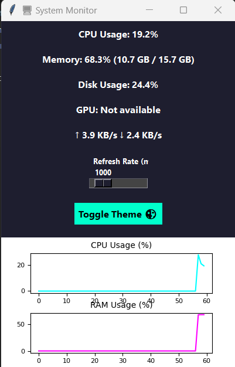
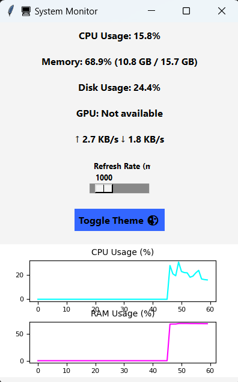
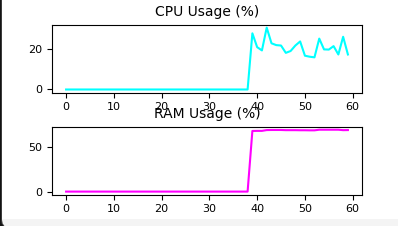

# 🖥️ System Monitor - Python Desktop App

A beautiful, animated **System Monitor** built with **Tkinter**, **Matplotlib**, and **psutil**.  
It displays **live CPU, RAM, GPU, Disk, Network usage**, and includes **real-time charts**, **blur effect**, and **theme toggling** (dark/light).

---

## 📸 Screenshots

| Main UI (Dark Mode)                   | Main UI (Light Mode)                      |
| ------------------------------------- | --------------------------------- |
|  |  |

---

## ✨ Features

✅ Modern UI with glassmorphism blur (Windows only)  
✅ Live animated CPU & RAM usage charts  
✅ GPU usage + temperature (via `GPUtil`)  
✅ Upload/Download speed per second  
✅ Theme toggle: Light / Dark  
✅ Adjustable refresh rate (500ms to 5s)  
✅ Responsive design with `matplotlib` + `tkinter`

---

## 📁 Folder Structure

System-Monitor/
├── monitor.py # Entry point
├── ui.py # Handles GUI & live updates
├── utils.py # Helpers (formatting, networking, threading)
├── requirements.txt # Dependencies
├── screenshots/ # UI snapshots for README
└── README.md

yaml
Copy code

---

## ⚙️ Setup Instructions

💡 Works on **Windows**, **Linux**, & **macOS** (GPU + Blur only on Windows)

### 1. Clone the repository

```bash
git clone https://github.com/yourusername/system-monitor.git
cd system-monitor
```
### 2. Create and activate a virtual environment
```bash
python -m venv venv
```
Activate:
Windows:
```bash
venv\Scripts\activate
```
macOS/Linux:

```bash
source venv/bin/activate
```
### 3. Install dependencies
```bash
pip install -r requirements.txt
```
❗ If you see ModuleNotFoundError: No module named 'distutils', 
## Install:

Ubuntu/Debian
```bash
sudo apt install python3-distutils
```
🚀 Running the App
```bash
python monitor.py
```
📦 Dependencies
```bash
nginx
Copy code
psutil
GPUtil
matplotlib
```
Install manually if needed:
```bash
pip install psutil GPUtil matplotlib
```
🔧 Optional (GPU/Fan/Temp Monitoring)
To enable fan speed/temperature on Windows, you can integrate with:

- OpenHardwareMonitor
- LibreHardwareMonitor

These tools expose sensors that psutil or third-party packages can tap into.

### 📈 Live Chart Example


### 🌈 Customization Ideas

- Add system tray integration
- Add logging/export to CSV
- Show process list (like top)
- Add battery status
- Add alerts for high usage

## 🧑‍💻 Author
#### Built by Nabina
Feel free to fork and improve this project!

## 🪪 License
MIT License – free to use, modify, and share.

